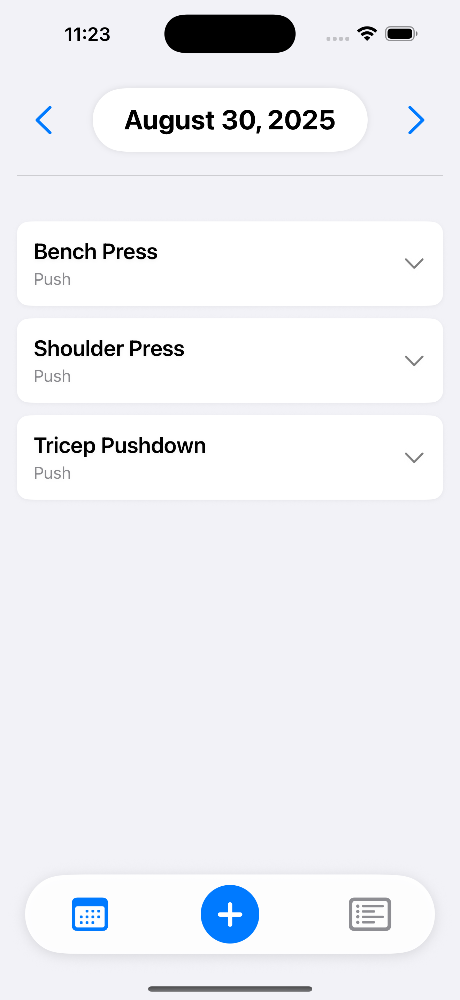
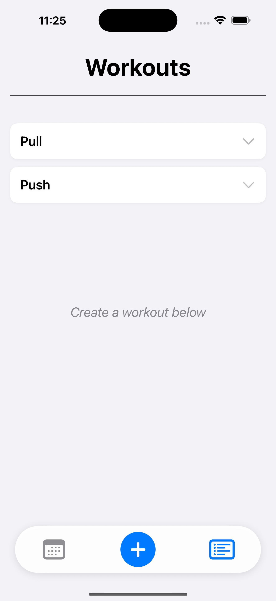
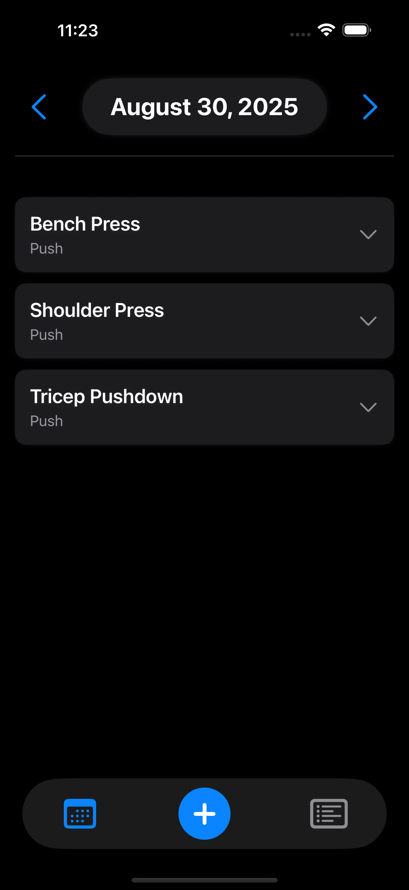
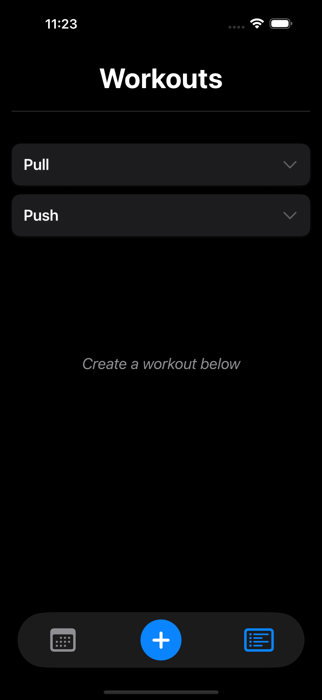
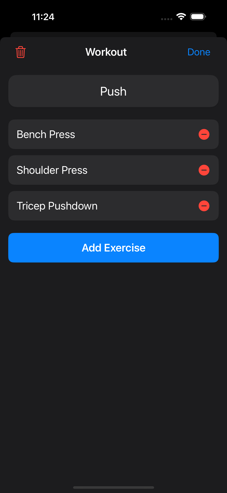

# NextSet

---

## Table of Contents

- [Overview](#overview)
- [Features](#features)
- [How It Works](#how-it-works)
- [Screenshots](#screenshots)
- [Installation](#installation)
- [Contribution](#contribution)
- [Contact](#contact)

---

## Overview

**NextSet** is your personal iOS workout tracker designed to help you level up your fitness game. Track your workouts day-by-day, log exercises, sets, and reps — and most importantly, **see your progress and push yourself further every time**. 

By focusing on **progressive overload**, NextSet empowers you to beat your previous best and achieve new personal records with every session.

---

## Features

- **Daily Workout Tracking:** Log your exercises, sets, and reps for each workout day.
- **Exercise History:** View your previous sets to compare performance and set new goals.
- **Progressive Overload Focus:** Stay motivated by tracking incremental improvements.
- **Clean, Intuitive iOS Design:** Easy-to-use interface optimized for iPhone.
- **Visual Progress:** Quickly glance at past workouts and your personal growth.

---

## How It Works

1. **Create a Workout:** Add exercises for your session.
2. **Log Sets & Reps:** Input the number of sets and reps for each exercise.
3. **Review Past Workouts:** See your previous performances to challenge yourself.
4. **Push for Progress:** Use your history to increase weight, reps, or sets — keeping progressive overload front and center.

---

## Screenshots

  
  
  
  
  

  
  
  
  
  

---

## Installation

We are working to get NextSet available on the iOS App Store. 
For now, simply clone the project, open it in Xcode, and deploy it to your iPhone.
Then you can start tracking your workouts and pushing your limits!

---

## Contribution

Want to help improve NextSet? Feel free to open issues or submit pull requests!

---

## Contact

Built by Christian Dees  
[Christianmdees@gmail.com](mailto:Christianmdees@gmail.com)

---

*Keep pushing forward, one set at a time!*
